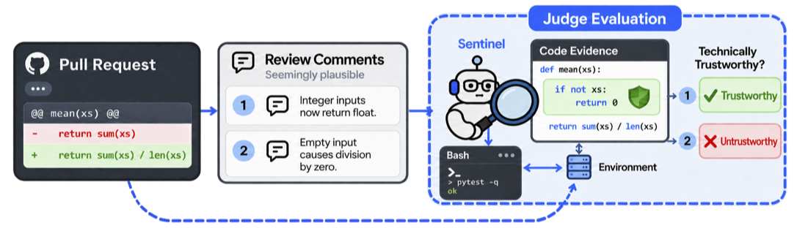

<div align="center">

# CRJudgeBenchmark

### The review sounds confident. Does the code agree?

A benchmark for judging whether a code-review comment is technically trustworthy.

**1,199 labeled examples · 124 pull requests · 9 repositories**

[Quick start](#quick-start) · [The task](#the-task) · [Dataset](#dataset) · [Evaluation](#evaluation) · [License](#license)

</div>

---

Code reviews make claims: a change introduces a bug, a check is missing, an API behaves differently. Deciding whether to trust those claims takes more than reading a convincing explanation. It takes checking the code and its context.

**CRJudgeBenchmark puts the reviewer under review.** Given a pull request and one target comment, a model must decide whether that comment is technically trustworthy. Models can work from the supplied context or inspect the repository before making a judgment.

<p align="center">
  
</p>

## A tiny taste

Consider this function:

```python
def normalize_names(names):
    return sorted(name.strip() for name in names)
```

A reviewer writes:

> “This sorts the caller's list in place, so later code will see the names in a different order.”

Would you trust that comment?

<details>
<summary><strong>Reveal the judgment</strong></summary>

**`false` — technically untrustworthy.** `sorted(...)` returns a new list. This function does not reorder the caller's list.

The comment describes a plausible bug, but its claim does not match the code. That is the kind of distinction a code-review judge must make.

*This is a simplified illustration, not an example from the released dataset. Benchmark examples include full PR context and a target comment within a review timeline.*

</details>

## The task

**One pull request. One target comment. One boolean judgment.**

| The judge receives | The judge decides |
| --- | --- |
| PR title and description, review patch, base commit, and the target review comment | Is this comment technically trustworthy in this context? |

| Label | Meaning |
| --- | --- |
| `true` | The target comment is technically trustworthy in the given context. |
| `false` | The target comment is technically untrustworthy in the given context. |

The label belongs to **the comment identified by `judged_entry_id`**. It does not rate the whole PR or every comment in the discussion. General PR comments without a file association are judged in the overall PR context.

Each example also includes linked issues and a PR activity timeline. These provide additional context, but later replies can reveal the answer; choose and report your context policy when evaluating.

## Quick start

From the repository root, read an example and find its target comment. No extra packages are needed.

```python
import json

with open("data/train.jsonl", encoding="utf-8") as f:
    row = json.loads(next(f))

target = next(
    entry for entry in row["code_review"]
    if entry.get("id") == row["judged_entry_id"]
)
print(row["pull_request"]["title"])
print(target["body"])
gold_label = row["trustworthy"]  # For training or scoring, not the model prompt.
```

Use `data/validation.jsonl` or `data/test.jsonl` to read another split. Judge the target comment with its PR and code context, keeping labels and construction metadata outside model inputs. See [Evaluation](#evaluation) for details.

## Dataset

Three UTF-8 JSON Lines files. One example per line. Every released label is a JSON boolean; none are missing.

| Split | File | Examples | `true` | `false` |
| --- | --- | ---: | ---: | ---: |
| Train | [train.jsonl](data/train.jsonl) | 714 | 455 | 259 |
| Validation | [validation.jsonl](data/validation.jsonl) | 126 | 80 | 46 |
| Test | [test.jsonl](data/test.jsonl) | 359 | 229 | 130 |
| **Total** | | **1,199** | **764** | **435** |

**No pull request crosses split boundaries.** Splits are grouped by `(repo, pull_request.pull_number)`. Repositories can recur across splits, so this evaluates generalization to held-out PRs, not entirely unseen repositories.

<details>
<summary>How the splits were constructed</summary>

The original train/test split targeted 70%/30% of examples while preserving PR groups and approximately preserving each label's proportion. Validation was then drawn from 15% of the original training pool, leaving the test split unchanged.

Both selections used seed 42 and a subset-sum procedure over shuffled PR groups to reach the label-count targets. The final proportions are approximately 59.55% train, 10.51% validation, and 29.94% test.

</details>

### Inside an example

| Part | What it contains |
| --- | --- |
| **PR context** | Repository, language, PR title and body, base commit, and review patch |
| **Discussion** | Linked issues and a timeline of comments, reviews, replies, and commits |
| **Target** | `judged_entry_id`, which selects exactly one comment in `code_review` |
| **Answer** | `trustworthy`, the gold boolean label for that comment |
| **Construction metadata** | Identifiers, source information, and optional perturbation type; keep these out of model inputs |

The pair `(instance_id, judged_entry_id)` uniquely identifies all 1,199 examples. `instance_id` alone is not unique. Every example has exactly one matching target entry.

<details>
<summary>Full field reference</summary>

| Field | Type | Description |
| --- | --- | --- |
| `instance_id` | string | PR-derived identifier; perturbed variants have a `#perturb-…` suffix. Not unique by itself. |
| `judged_entry_id` | integer | ID of the target entry in `code_review`. |
| `judged_user` | string | GitHub login associated with the target comment; inherited from the original comment for perturbations. |
| `repo` | string | GitHub repository in `owner/name` form. |
| `language` | string | Recorded primary language of the repository. |
| `pull_request` | object | `pull_number`, `title`, `body`, `created_at`, `base_commit`, and `patch_to_review`. |
| `resolved_issues` | list of objects | Linked issues with `number`, `title`, and `body`. |
| `code_review` | list of objects | PR activity timeline, including comments, reviews, replies, and commits. |
| `problem_domain` | string | Recorded task category, such as `Bug Fixes` or `New Feature Additions`. |
| `hint_text` | string | Reserved context field; empty in every released example. |
| `trustworthy` | boolean | Gold label for the target comment. |
| `source` | string | Construction provenance; exclude from model inputs. |
| `perturbation_kind` | optional string | `location`, `negation`, or `symbol`; present only for perturbations in the raw JSONL. |

Timeline entry types are `inline`, `inline_reply`, `pr_comment`, `review`, and `commit`. Comment entries contain `id`, `body`, `user`, and `created_at`; depending on type, they may also contain `review_path`, `diff_hunk`, `in_reply_to_id`, or `review_state`. Commit entries use `sha` and `message`. Optional fields may load as `None` through tabular dataset libraries.

</details>

## Evaluation

A useful result should show whether a judge can assess the comment from the evidence available to it. Make that evidence explicit.

1. **Keep answers private.** Exclude `trustworthy`, `source`, `perturbation_kind`, and original `instance_id` values from model inputs and agent-accessible files. Source tags and perturbation suffixes reveal labels. Use opaque evaluation IDs when needed.
2. **Define the context.** Later replies or reviews in the raw timeline may reveal the answer. For a focused context, omit other timeline entries, reviewer identities, and review states. Report results using complete timelines separately.
3. **Track the code version.** For repository inspection, use the recorded `base_commit`. Distinguish evidence from the base version from evidence obtained after applying `patch_to_review`.
4. **Respect the split.** Use training examples for parameter updates and teacher-generated supervision, validation for model selection, and the fixed test set for final evaluation. Preserve PR groups in derived datasets.

Treat `true` as the positive class and report:

| Report | Purpose |
| --- | --- |
| Accuracy and macro-F1 | Overall correctness and performance across both classes |
| Per-class precision and recall | Which judgments the model gets wrong |
| Invalid or missing prediction counts | How often the judge fails to provide a usable answer |
| Results by construction source, with sample counts | Performance on naturally occurring versus perturbed examples |
| Context policy and repository access | What evidence the model could use |

## License

The original dataset contributions, including its selection and arrangement, annotations, and documentation, are licensed under the [Creative Commons Attribution 4.0 International License (CC BY 4.0)](https://creativecommons.org/licenses/by/4.0/), to the extent that the dataset contributors hold the relevant rights. See [LICENSE](LICENSE) for the full terms.

CC BY 4.0 permits sharing and adaptation, including for commercial purposes, subject to its attribution requirements. Credit **CRJudgeBenchmark**, link to the dataset release used and the license, and indicate any changes. When reporting experimental results, also record the dataset revision.

Third-party code, patches, review comments, issue text, and other collected material remain subject to their original licenses and applicable rights; this release does not relicense them or grant additional rights to them. Source repositories are identified in the `repo` field, and PR numbers are available in `pull_request.pull_number`. Users must comply with any applicable upstream terms.
